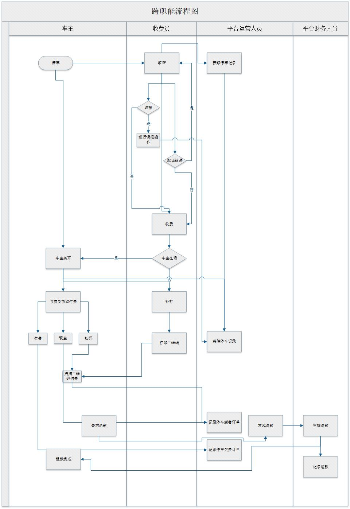
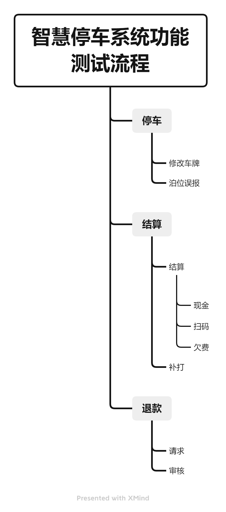

该文档主要为**测试人员**编写，它将带领你进行一个固定的测试流程，并列出一系列**测试用例**来确保这些核心功能的稳定。在每次代码更新与系统上线之后，测试人员都应该及时按照该文档对系统进行测试，并根据更新内容对该文档进行修改。

# 1. 功能测试与测试用例

## 1.1 什么是功能测试？

功能测试是一种软件测试，根据**功能要求/规范**来验证软件系统。功能测试的目的是测试软件应用程序的每个功能，通过提供适当的输入，根据功能要求验证输出。

功能测试主要涉及黑盒测试，它不关心应用程序的源代码。这种测试检查用户界面、API、数据库、安全、客户/服务器通信和其他被测应用程序的功能。测试可以手动完成，也可以使用自动化。

## 1.2 业务流程描述

该流程列出了功能测试中的业务逻辑，其中的不同步骤将涉及到车主、PDA（搭载”智慧停车“APP的移动设备）与PC（智慧停车云平台），以下对核心流程所模拟的业务进行描述：

1. 车主在特定泊位上停车后，收费员使用PDA，选中正确泊位后，使用PDA【停车】功能拍照或手动记录所停车辆的车辆信息：车牌号、车型等。该记录被保存至PC端【在场车辆订单】。
   1. 如果收费员输入错误车牌，则收费员使用PDA端【修改车牌】功能。改动反映至PC端【在场车辆订单】。
   2. 如果收费员在空泊位上错误地记录车辆，则收费员使用PDA端【误报】功能。PC端【在场车辆订单】中删除该记录。
2. 如果车主在场，收费员使用PDA协助车主进行费用【结算】。
   1. 扫码支付，记录保存至PC端【停车缴费订单】与【历史订单管理】。
   2. 现金支付，记录保存至PC端【停车缴费订单】与【历史订单管理】。
   3. 欠费支付，记录保存至PC端【停车欠费订单】与【历史订单管理】。
3. 如车主不在场，收费员使用PDA端【补打】功能打印费用单。
   1. 车主通过扫描费用单缴纳停车费用。记录保存至PC端【停车缴费订单】与【历史订单管理】。
4. 如果车主试图退款，那么他可以通过电话或公众号向运营人员提出申请：
   1. 运营人员通过PC端【停车缴费订单】发起退款请求。
   2. 财务人员通过PC端【订单修改退款记录】进行审核，若审核通过，则车主收到退款。

展开查看职能流程图

## 1.3 功能测试方案

在智慧停车项目的功能测试流程中，主要用到的测试策略为：

| 测试策略 | 目的                                                         | 项目                                                        |
| -------- | ------------------------------------------------------------ | ----------------------------------------------------------- |
| 冒烟测试 | 在实际测试之前，先进行冒烟测试，看看主要功能是否正常，然后再对其他测试程序进行微调 | 在正式测试开始前，确认PDA与PC平台的主要功能使用没有明显错误 |
| 集成测试 | 测试多个软件组件作为一个群体是否运作良好                     | 在测试中，确认PDA与PC平台的数据互通正常                     |
| 回归测试 | 验证最近的变化或更新对已经存在的功能没有负面影响             | 在新版本部署后，确认已存在的功能没有受到影响                |
| 界面测试 | 检查用户是否能按预期与界面互动                               | 确认PDA与PC平台的操作界面正常                               |
| 单元测试 | 检查系统的各个单元或组件是否运作良好                         | 由开发人员编写                                              |

## 1.4 核心测试流程

本文中给出的测试流程旨在测试以上所描述的业务流程。

核心测试流程按顺序列出如下：

展开查看职能流程图

## 1.5 测试用例

在软件工程中，测试用例 Test Case（以下简称为用例）是对输入、执行条件、测试程序和预期结果的规范，它定义了一个要执行的单一测试，以实现特定的软件测试目标，如锻炼一个特定的程序路径或验证与特定要求的一致性。

### 1.4.1 测试用例的元信息

在未采用测试管理平台的情况下，测试用例的元信息可以反映在用例文件的文件名上，如“用例-模块-测试时间（固定为2位数字的‘年-月-日’）”，例如“用例-退款-22-06-22.xlsx”。

### 1.4.2 测试用例的格式与范例

| 模块           |  ID  | 测试内容 | 测试人 | 前置条件   | 测试步骤 | 预期结果        |  状态  | 实际状态       |       评论        |
| -------------- | :--: | -------- | :----: | ---------- | -------- | --------------- | :----: | -------------- | :---------------: |
| x.x.1 模块功能 |  01  | 功能1    | 员工a  | xx已被打开 | 1. 步骤a | 步骤a的期望结果 |  通过  | 符合期望结果   | 测试用的数据为xxx |
|                |      |          |        |            | 2. 步骤b | 步骤b的期望结果 |  通过  | 符合期望结果   |                   |
|                |      |          |        |            | 3. 步骤c | 步骤c的期望结果 | 未通过 | 不符合期望结果 |    复现不稳定     |
|                |  02  | 功能2    | 员工a  |            | 1. 步骤a | 步骤a的期望结果 | 未执行 | -              |         -         |
| x.x.2 模块功能 |  01  | 功能1    | 员工b  | -          | 1. 步骤a | 步骤a的期望结果 | 未执行 | -              |         -         |
| ...            |      |          |        |            |          |                 |        |                |                   |

以下详细描述了测试用例（以下简写为用例）的各个组成部分：

- **模块：**用例所测试功能所属的模块。
- **ID：**该测试用例的ID，用于编写测试报告与定位单个用例。
- **测试内容：**用例试图测试的具体功能。
- **测试人：**测试该用例的人员。
- **前置条件：**用例执行的必备条件。
- **测试步骤：**用例中的单个具体操作，例如点击按钮、输入文本、手势操作等。
- **预期结果：**步骤执行后，期望软件正常工作时产生的结果。
- **状态：**测试步骤的预期结果与实际状态的差异，根据未测试/符合/不符合，将状态分为**未执行/通过/或未通过**。
- **实际结果：**单个步骤执行后，软件产生的实际结果。
- **评论：**测试人员所使用的测试数据、对于测试的额外描述或其他内容。

## 1.5 测试报告

*-todo- [用例-综合-22-06-22.xlsx](测试用例\用例-综合-22-06-22.xlsx) *

# 2. 核心业务流程及其功能性测试

 [用例-综合-22-06-22.xlsx](测试用例\用例-综合-22-06-22.xlsx) 

## 2.1 停车

停车流程的详细描述如下：

1.  *-todo-*
2.  *-todo-*

### 2.1.1 功能测试用例

 [用例-停车-22-06-22.xlsx](测试用例\用例-停车-22-06-22.xlsx) 

## 2.2 结算

结算流程的详细描述如下：

1. *-todo-*
2. *-todo-*

### 2.2.2 功能测试用例

 [用例-付款-22-06-22.xlsx](测试用例\用例-付款-22-06-22.xlsx) 

## 2.3 退款

退款流程的详细描述如下：

1. 当车主付费后，可以通过微信公众号“数字城市”或服务电话联系运营商申请退款（注：若以现金支付则无法退款）。
2. 收到退款申请后，云平台的运营人员通过【运营】模块的【停车缴费订单】功能对车主要求退款的缴费订单进行处理，发起电子支付退款请求。
3. 随后运营方的财务人员将通过【财会】模块的【订单修改退款记录】功能进行审核。
3. 如果审核未通过，则退款申请被拒绝，若审核通过，则车主支付的费用将被退还到其银行账户中。

### 2.3.1 功能测试用例

 [用例-退款-22-06-22.xlsx](测试用例\用例-退款-22-06-22.xlsx)

# 3. 非功能性测试

# 附录：测试报告记录

| 时间     | 测试人员 | 备注 | 文件 |
| -------- | -------- | ---- | ---- |
| 22-06-22 |          |      |      |
|          |          |      |      |
|          |          |      |      |

